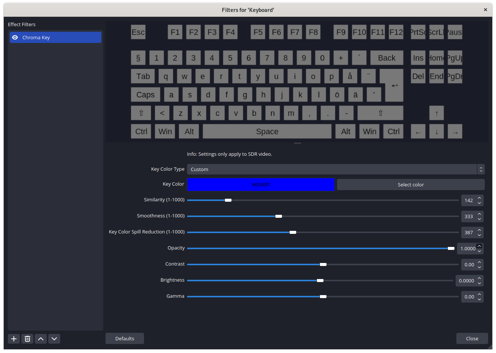
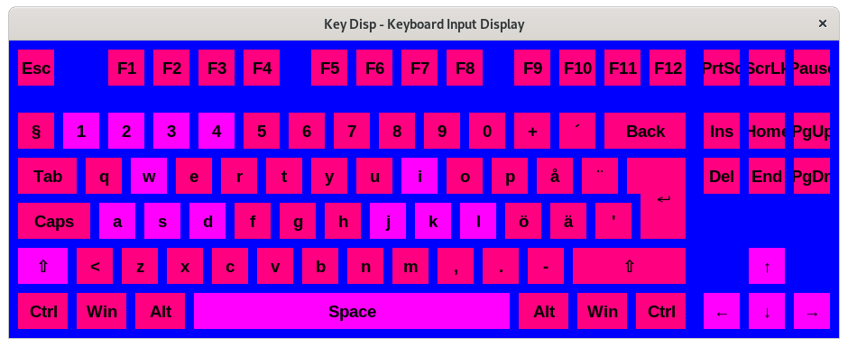

# key-disp
A [NohBoard](https://github.com/ThoNohT/NohBoard) inspired project written in Python, a keyboard input display. The program is compatible with Windows and Linux. 

**Note: in order to run on Linux this program requires root**

## Dependencies/APIs
* Uses the Python GUI library "tkinter"
* [Keyboard](https://github.com/boppreh/keyboard)
* [Mouse](https://github.com/boppreh/mouse)

---

## My OBS settings

Here is how i set up the program with a Chroma Key in OBS to remove the background with the default preset:

Create a Window Capture source in OBS, and go to filters. Add effect "Chroma key" and pick custom color, and use the pick screen color option. Here are the settings that I use in OBS:



---

## Documentation

### Introduction

The main way that this program functions is through the use of *Layouts* and *Presets*. Right now there is no graphical editor, so unfortunately the main way of editing presets is through manually editing the text files. The main text files are:

* "settings.txt" - This file contain which *Layout* and *Preset* to use.
* *Layout* file - A file which at the top contains how large the keyboard window is, and contains the definition for all keys.
* *Preset* file - A file that defines the background color of the keyboard (either for chroma keying or if you choose to leave it in), and defines the **presets**. A key in the layouts file is hooked to a specific preset, to choose how that particular key works. So for instance, if you want a full keyboard capture and specifically highlight some keys, you can hook those keys to a separate preset. Example:



---

### Layouts

A *Layout* file is placed in the ```/Layouts``` folder and contains the size of the keyboard on the first row. The syntax for it is:   

```
size=WxH
```

where "W" is width and "H" is height, for example

```
size=920x330
```

if you want a keyboard window that is 920 pixels wide and 330 pixels high.

The rest of the file contains entries for keys to be included on your keyboard. The keys has the following entries:

* "key" - This is the scancode or string representation of what the key is called. This value can be found by running the program ```/devtools/getscancode.py``` and pressing the corresponding key, and the program will print that value to the terminal.
* "lowercase" - Lower case version of the character
* "uppercase" - Upper case version of the character
* "shift" - Does this key change from "lowercase" to "uppercase" when you press shift?
* "caps" - Does this key change from "lowercase" to "uppercase" when you press caps lock? 
* "posx" - At what x position should this key be placed?
* "posy" - At what y position should they key be placed?
* "width" - Width of the key (**Note**: all keys are rectangular)
* "height" - Height of the key
* "preset" - Which preset does this key belong to?

**Note**: The parser doesn't care about these keywords, the order in which they appear is what matters.

All keys are rectangular, for the ISO enter key I have added a dummy key to make the shape.

The token ":" is used to separate attributes, and the token "=" is used to separate keyword and its value. Example entry for the key "q":

```
key=16:lowercase=q:uppercase=Q:shift=True:caps=True:posx=85:posy=130:width=40:height=40:preset=1
```

The program also has mouse support. Currently you can only get left mouse button, right mouse button, and middle mouse button, and additionally there is a mouse speed indicator. The mouse buttons have the following values for the "key" entry:

* left mouse button - key=mouse.LEFT
* right mouse button - key=mouse.RIGHT
* middle mouse button - key=mouse.MIDDLE

The mouse speed indicator has a special syntax. The "lowercase" and "uppercase" attributes are replaced with "sensitivity" and "limit."

* "sensitivity" - The indicator will move the amount of pixels your cursor moved in a "tick" (the position is polled 60 times per second by the mouse hook) divided by the sensitivity. So higher value will cause the indicator to be slower.
* "limit" - The value that your indicator is capped to. So if you have limit 50 your indicator will max move 50 pixels in positive/negative x/y direction.

Example:

```
key=mouseindicator:sensitivity=3:limit=60:shift=False:caps=False:posx=990:posy=150:width=10:height=10:preset=1
```

---

### Presets

A *Preset* file is placed in the ```/Presets``` folder and contains the background color of the keyboard on the first row. The syntax for it is:

```
backgroundcolor:color
```

where "color" is the color of the key. You can either use some of the standard colors in the tkinter library, such as grey, white, black, blue, green, etc, or you can write a specific RGB hex code with the following syntax:

```
backgroundcolor:#RRGGBB
```
as an example purple, which has red: 255, green: 0 and blue: 255

```
backgroundcolor:#FF00FF
```

The rest of the file contains entries for the presets. The presets has the following entries:

* "preset" - This is the number of the current preset
* "keybackgroundcolor" - Background color of the key, when the key is not pressed
* "keyforegroundcolor" - Foreground color (the color of the text), when the key is not pressed
* "font" - The font of the key, when the key is not pressed
* "fontsize" - The font size of the key, when the key is not pressed
* "bold" - Is the font bold, when the key is not pressed?
* "italics" - Is the font italics, when the key is not pressed?
* "backgroundcolorPressed" - Background color of the key, when the key is pressed
* "foregroundcolorPressed" - Foreground color (the color of the text), when the key is pressed
* "fontPressed" - The font of the key, when the key is pressed
* "fontsizePressed" - The font size of the key, when the key is pressed
* "boldPressed" - Is the font bold, when the key is pressed?
* "italicsPressed" - Is the font italics, when the key is not pressed?
* "rgb" - 0 = not RGB, 1 = has RGB

If the keyboard has RGB, then the preset will additionally need the following attributes:

* "rgbtype" - What type of RGB effect it is. The ones that exist right now are:
    - 0 - The whole keyboard changes color together and scrolls through the different colors. 
    - 1 - The colors ripple through the entire keyboard.
* "rgbspeed" - How fast the RGB effect moves.

**Note**: The parser doesn't care about these keywords, the order in which they appear is what matters.


The token ":" is used to separate a keyword and its value. Example preset:

```
preset:1
keybackgroundcolor:#FF0080
keyforegroundcolor:black
font:Arial
fontsize:14
bold:True
italics:False
backgroundcolorPressed:#FFFF00
foregroundcolorPressed:black
fontPressed:Arial
fontsizePressed:14
boldPressed:True
italicsPressed:False
rgb:0
```

Another example with RGB:

```
preset:1
keybackgroundcolor:grey
keyforegroundcolor:black
font:Arial
fontsize:16
bold:False
italics:False
backgroundcolorPressed:white
foregroundcolorPressed:black
fontPressed:Arial
fontsizePressed:16
boldPressed:False
italicsPressed:False
rgb:1
rgbtype:0
rgbspeed:1
```
